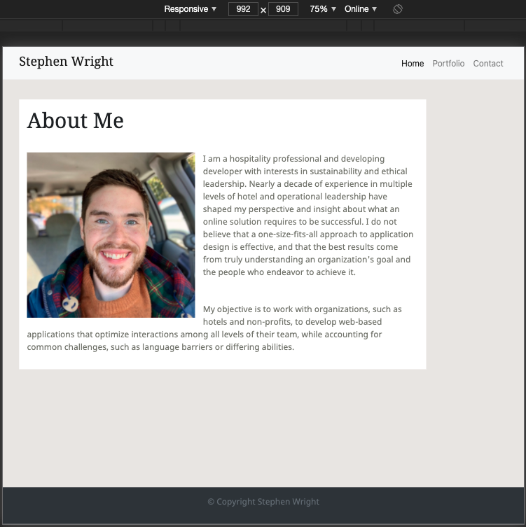

# HW2: Responsive Portfolio

## The Project

This site was built to demonstrate the fuctions of responsive design, and how they will perform across different types of displays. 

To account for end user experience across various devices, the web page will adjust its formatting to deliver an optimized experience. 

Bootstrap elements such as navigation bar menus will automatically adjust to browser size. 

Figure 1: At a width of 992 pixels, the browser will display the full navigation bar. 

<!-- screenshot 1 here -->

Figure 2: At a width of 400 pixels, the browser will display a collapsed menu bar. 

<!-- screenshot 2 here -->

## Requirements

This website requires a web browser such as Safari, Firefox, Chrome, or Opera to view. 

## Credits

This site was built using Bootstrap: "Designed and built with all the love in the world by the Bootstrap team with the help of our contributors.

Currently v5.0.0-beta1. Code licensed MIT, docs CC BY 3.0."

## Contact

You may contact me at wrightsah@icloud.com.

## License

This project uses the following license: [MIT License](LICENSE)
